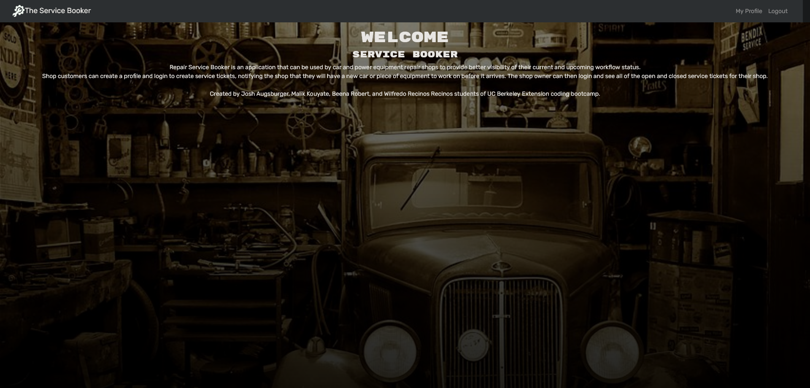
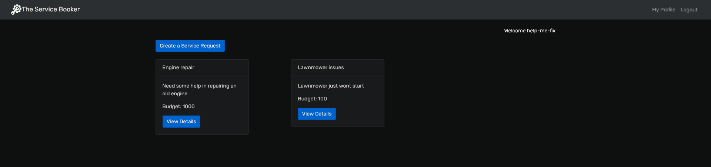

# Service Booker

## Table of Contents:
[description](#desc)

[Installation](#1)

[Usage](#2)

[Credits](#3)

[License](#4)

[Contributing](#5)

[Tests](#6)

[Questions](#7)

# 
## 0.Description:

A handy application that makes requesting of services a breeze. Simply create a profile, create a ticket, and youre good to go!

2 live links here just incase one is down:
[Live Link 1](https://service-booker-application.herokuapp.com/)
[Live Link 2](https://powerful-refuge-32093.herokuapp.com/)

# 
## 1.Installation:
This application is deployed live on heroku however if you want to use this as a skeleton simply clone this repo and run npm install.\
With that all dependencies will be added and you should be good to go. ( This application does require node.js )
This application also follows a mern structure so having a local instance of mongoDB running is a neccesity for this applications local functionality.
# 
## 2.Usage:
Going to need to sign up with an email, username, and password.\
After all  of this you will be brought to a page where you can create a ticket.\
Simply click add a ticket, enter the info on  the ticket and submit it.

User side:

When the server is launched then the homepage appears -> then on the homepage we have a login/signup button -> when that button is pressed,  the user is prompted to login or signup within a modal.\
When they either login or signup, they are brought to their profile page -> this page will display their current request tickets as well as have a tab that will take them to their previous tickets.\
When tickets are displayed, there will be an additional button on them ( a cancel button ) that will allow a user to delete a ticket.\
There will also be another link that will allow for them to create a new ticket -> if this link is clicked the ticket will prompt the user for their product type, the problem with the product, and their budget.\
This ticket will be added to their profile page and they will have the opportunity to add comments as they please.
# 
## 3.Credits:
[mkalik](https://github.com/mkalik) | [jaugsbu2](https://github.com/jaugsbu2) | [will198735](https://github.com/will198735) | [Beenarob](https://github.com/Beenarob)
# 
## 4.License:
https://opensource.org/licenses/MIT
# 
## 5.How to contribute:
Do what you please just give credit where credit is due.
# 
## 6.Tests:
If you want to test this application, run npm run develop in the root and the server and client will start locally. From there fiddle as you please
# 
## 7.Questions:
Please contact: Feel free to leave ask anyone of the creators
